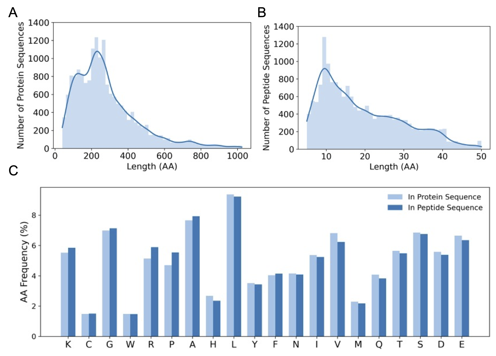
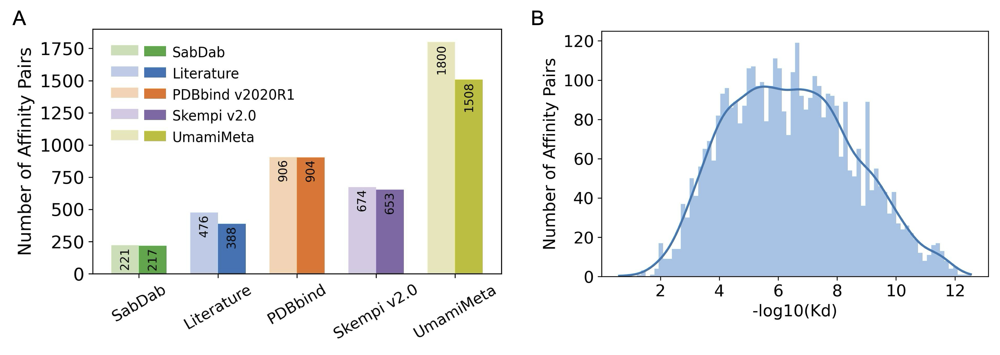

# PepInter Dataset

## ProtFragDB

The original dataset is obtained from [PPI3D](https://bioinformatics.lt/ppi3d/).

Using the following criteria: 
- (i) structural resolution better than 4.0 Å; 
- (ii) protein sequence length fewer than 1,000 amino acids; 
- (iii) a maximum sequence identity of 40%

[Rosetta Peptiderive protocol](https://github.com/CTDancer/pbg-ada) was applied to these PPIs to generate pseudo protein-peptide fragment pairs, where fragment lengths ranging from 5 to 50 amino acids

## PepInter_cls - PepInterDB

The original dataset is obtained from [PDB](https://www.rcsb.org/), accessed in September 2025.

- the protein chain to contain 40-1000 residues.
- the peptide chain to contain 5-40 residues.

Yielding a final dataset of 17,054 protein-peptide pairs.

The distribution of the dataset is as follows:

## PepInter_aff - - PepAffDB

The affinity dataset is obtained from several sources:

| Dataset | Number of protein-peptide pairs |
|---------|--------------------------------|
| [PDBbind](https://www.pdbbind.org.cn/) | 937  |
| [SKEMPI](https://life.bsc.es/pid/skempi2)  | 246  |
| [SabDab](https://opig.stats.ox.ac.uk/webapps/sabdab-sabpred/sabdab)  | 2,069  |
| [UmamiMeta](https://umami.bio.unipd.it/) | 1,869   |
| published literature | 481  |

After remove the redundant protein-peptide pairs, the final dataset contains 3,670 high-quality protein-peptide pairs with experimental binding affinity values.

The distribution of the dataset is as follows:

